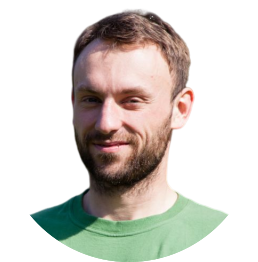





# Matej Kala

Chemist, Backend and DevOps Engineer

> Work smart

<ul id="web-address">
<li><i class="fa-solid fa-at"></i><a href="mailto:{{page.email}}">{{page.email}}</a></li>
<li><i class="fa-solid fa-house-laptop"></i><a href="https://{{page.home}}">{{page.home}}</a></li>
<li><i class="fa-brands fa-github"></i><a href="https://{{page.github}}">{{page.github}}</a></li>

<li><i class="fa-solid fa-home"></i>{{page.address}}</li>

<li><i class="fa-solid fa-phone"></i>{{page.phone}}</li>
</ul>

## Currently

I recently took a leave to get the education needed to start my new career.
It was amazing to gain so much new knowledge. But I'm not going to end here.
I have a strong desire to improve my skills and further expand my knowledge to excel in the new job.

## Tech Stack

+ <i class="fa-solid fa-star"></i>Java 
+ <i class="fa-solid fa-star-half-stroke"></i>Python 
+ <i class="fa-solid fa-star"></i>SpringBoot 
+ <i class="fa-solid fa-star-half-stroke"></i>Flyway 
+ <i class="fa-solid fa-star-half-stroke"></i>Docker 
+ <i class="fa-solid fa-star-half-stroke"></i>AWS 
+ <i class="fa-regular fa-star"></i>Terraform 
+ <i class="fa-solid fa-star"></i>CircleCI 
+ <i class="fa-solid fa-star-half-stroke"></i>SQL 
+ <i class="fa-solid fa-star"></i>Git 

[//]: # (<i class="fa-solid fa-star"></i>)
[//]: # (<i class="fa-solid fa-star-half-stroke"></i>)
[//]: # (<i class="fa-regular fa-star"></i>)

### Soft Skills

+ 
  Teamwork
+ 
  Attention to Detail
+ 
  Curiosity
+ 
  Problem Solving

### Interests

+ 
  ChatGPT
+ 
  Data analysis
+ 
  Design of Experiments

### Portfolio

+  [Chat Bot](https://{{page.github}}/resume-chatbot)
+  [Todo App](https://{{page.github}}/committed-project)

## Languages

[//]: # (<i class="fa-solid">🇬🇧</i>)

[//]: # (<i class="fa-solid">🇩🇪</i>)

[//]: # (<i class="fa-solid">🇨🇿</i>)

+  English - full professional proficiency
+  German - intermediate
+  Czech - native

## Experience

`2020-2022`
**Process Research Chemist**, _[Syngenta](https://www.syngenta.com/)_, Stein (AG), Switzerland


### Outline

Member of a small process R&D team developing scalable, safe and cost-efficient processes 
transferred to kilo-lab 
and investigating broad range of alternative pathways for patenting purposes 
or a future development.



### Responsibilities

Skillful planning and execution of multistep organic synthesis using a range of synthetic techniques 
(including e.g. microwave chemistry and photochemistry) on sub-mmol to mol scale.

  
Thorough planning and attention to detail while executing sensitive reactions 
(e.g. Schlenk techniques, drying and degassing of solvents,
work-up screening to avoid product decomposition).
Quantification (by qNMR or LC-UV in combination with statistical analysis) of investigated reactions and sensitive reagents with high degree of precision and accuracy.

Separation (using preparative Flash, TLC or RP-HPLC) and identification 
(using LC-MS, GC-MS with 1D and 2D NMR spectroscopy) 
of unknown side-products in proposed speculative reactions.

Optimization ranging from simple solvent screening (using published PCA or cluster analysis data) 
to multi-parameter optimization (using DoE). 
Conducting and analysing dozen reactions simultaneously.

Understanding laws of physical chemistry, 
reaction kinetics and reactivity hazards backed up by literature sources 
and hazard evaluation techniques (DSC) in order to conduct reactions in a safe manner.

Supporting young team members.
  




### Achievements

Participation in a project awarded with a company award.

Planning, execution and analysis of a multi-parameter optimization using DoE resulting in development of superior conditions giving very high enantioselectivity while decreasing expensive ligand and catalyst loadings.

  
Implementation of innovative reactions based on own ideas 
(new method for amidine synthesis or C-N coupling by Ag(I) or Cu(I)).
  



`2016-2019`
**Process Research Team Leader** _[Farmak](https://www.farmak.cz/)_, Olomouc, Czech Republic


### Outline
Development of multi-stage API production processes - from the laboratory route development and optimization through scale-up on 15 liters glass reactors to transfer of the final process to the pilot-plant for validation.


## Education

`2008-2013`
**Master's degree in Organic Chemistry** _[University of Chemistry and Technology](https://www.vscht.cz/?jazyk=en)_, Prague, Czech Republic

<!-- ### Footer

Last updated: December 2023 -->
