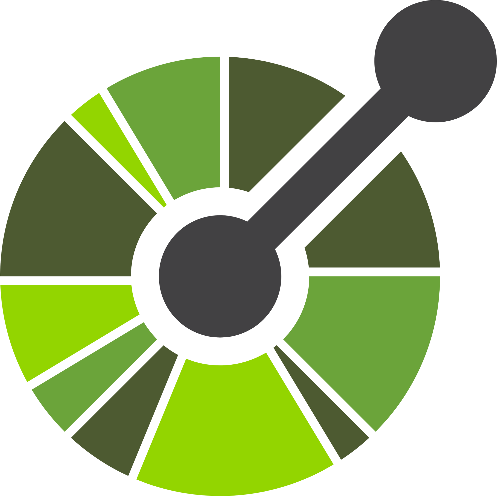
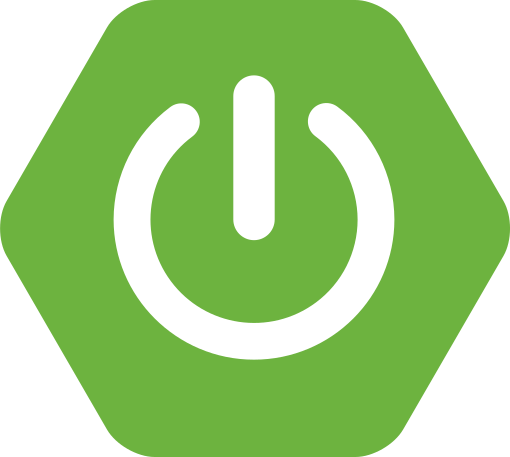
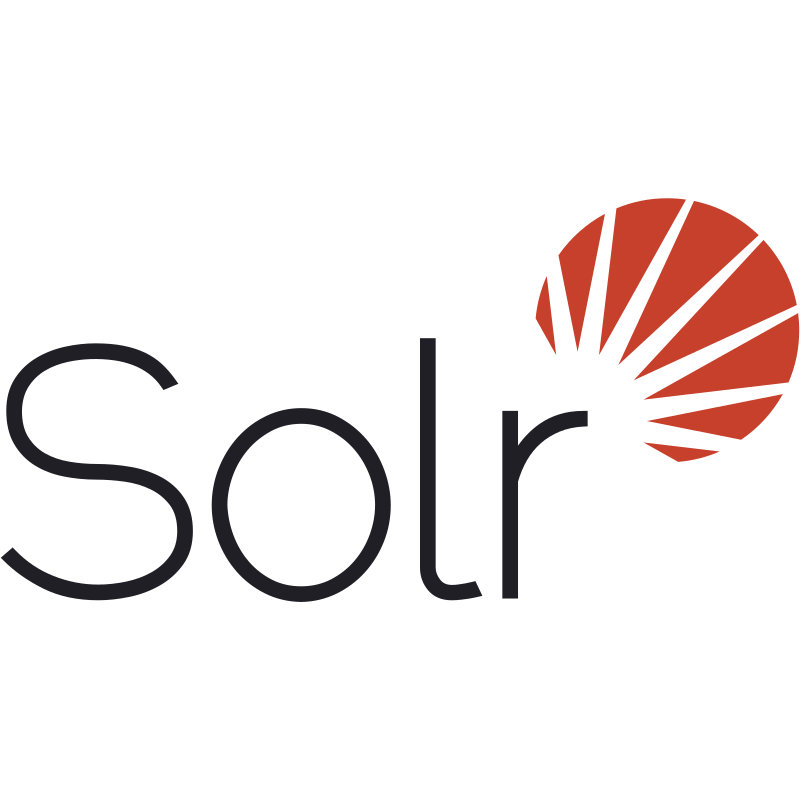
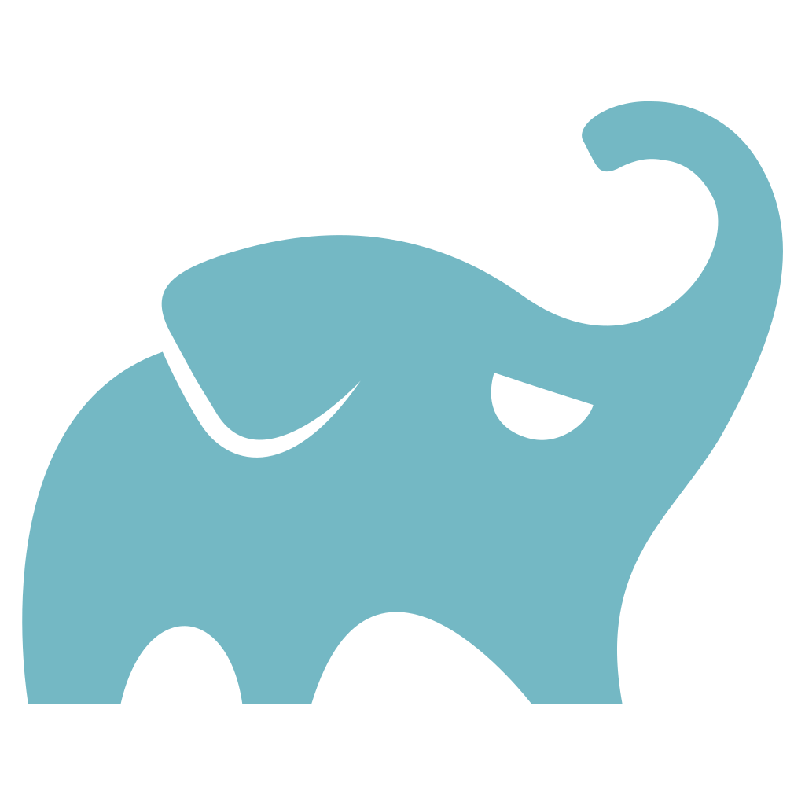
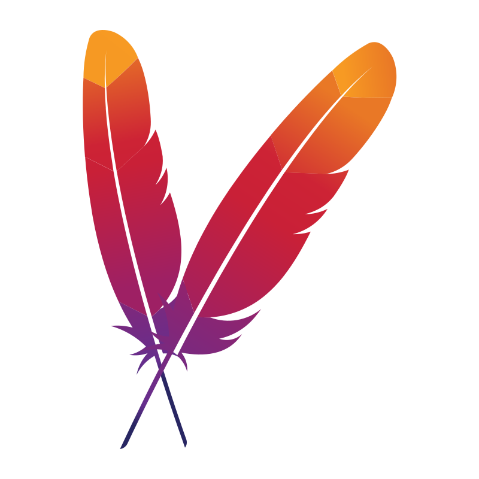
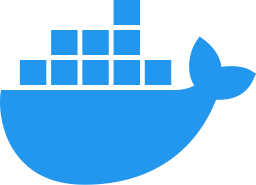
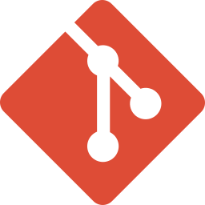





# {{page.title}}

{{page.subtitle}}

<ul id="web-address">
<li><i class="fa-solid fa-house-laptop"></i><a aria-label="homepage" target="_blank" href="https://{{ page.home }}">{{ page.home }}</a></li>
<li><i class="fa-brands fa-github"></i><a aria-label="GitHub" target="_blank" href="https://{{ page.github }}">{{ page.github }}</a></li>
<li><i class="fa-brands fa-linkedin"></i><a aria-label="LinkedIn" target="_blank" href="https://{{ page.linkedin }}">{{ page.linkedin }}</a></li>



<li><i class="fa-solid fa-ring"></i>{{ page.marital-status }}</li>





<li><i class="fa-solid fa-passport"></i>{{ page.citizenship }}</li>





<li><i class="fa-solid fa-home"></i><a aria-label="address" target="_blank" href="https://en.mapy.cz/turisticka?q={{ page.address | cgi_escape }}">{{ page.address }}</a></li>



<li><i class="fa-solid fa-phone"></i><a aria-label="phone" target="_blank" href="tel:{{ page.phone | replace: ' ', ''  }}">{{  page.phone }}</a></li>
<li><i class="fa-solid fa-at"></i><a aria-label="e-mail" target="_blank" href="mailto:{{ page.email }}">{{ page.email }}</a></li>
</ul>



> {{ page.quote }}





## Currently

I am a Java backend developer with almost 2 years of experience with the development of backend applications for Czech government agencies.

I have passion for the field and strong desire to keep learning new things.

I'm particularly drawn to engineering practices that ensure code quality and maintainability:
Test-Driven Development, Domain-Driven Design and automation of testing, deployment, and quality checks.



## Skills

+ 
  Driving Licence - B
+ 
  Teamwork
+ 
  Attention to Detail
+ 
  Curiosity
+ 
  Problem Solving

### Tech Stack

+ <i class="fa-solid fa-star"></i>Java 
+ <i class="fa-solid fa-star-half-stroke"></i>SQL 
+ <i class="fa-regular fa-star"></i>Python 
+ <i class="fa-regular fa-star"></i>Java Script 
+ <i class="fa-solid fa-star-half-stroke"></i>Open API 
+ <i class="fa-solid fa-star"></i>Spring 
+ <i class="fa-solid fa-star"></i>Spring Boot 
+ <i class="fa-solid fa-star-half-stroke"></i>Hibernate 
+ <i class="fa-solid fa-star"></i>JUnit 5 
+ <i class="fa-regular fa-star"></i>React 
+ <i class="fa-solid fa-star-half-stroke"></i>Kafka 
+ <i class="fa-solid fa-star-half-stroke"></i>Solr 
+ <i class="fa-solid fa-star-half-stroke"></i>Gradle 
+ <i class="fa-regular fa-star"></i>Maven 
+ <i class="fa-solid fa-star-half-stroke"></i>Docker 
+ <i class="fa-solid fa-star"></i>Git 
+ <i class="fa-regular fa-star"></i>Subversion 
+ <i class="fa-solid fa-star"></i>IDEA 

## Languages

+  English - full professional proficiency
+  German - intermediate
  
+  Czech - native

## Experience

<h3> </h3>

`Feb 2024 - now`
**Software Developer**
,
_[OKsystem](https://www.oksystem.com)_,
Prague, Czech Republic



### Outline

Member of a cross-functional team developing and maintaining two backend applications.
One legacy monolithic application power by _Maven_, _Java_ 8 and _Spring_ 4.
And one brand new microservice-based application power by _Gradle_, _Java_ 21 and _Spring Boot_ 3.

Adding features mostly spanning _HTTP_ (_REST_) communication, _Kafka_ messaging, database _CRUD_ operations
and scheduling tasks.





### Responsibilities

Unit and integration testing of the developed features.

Configure and populate _Solr_ cores for full-text search capabilities.

Deployment of the legacy application to integration environment.



<h3> </h3>

`2023 - 2024`
**Professional Development**
,
Career Break

<h3> </h3>

`2023`
**Process Research Chemist**
,
_[Teva](https://www.teva.cz/)_,
Opava, Czech Republic



### Outline

Member of a process research team developing API manufacturing processes.



<h3> </h3>

`2020 - 2022`
**Process Research Chemist**
,
_[Syngenta](https://www.syngenta.com/)_,
Stein (AG), Switzerland



### Outline

Member of a small process R&D team developing scalable, safe and cost-efficient processes 
transferred to kilo-lab 
and investigating broad range of alternative pathways for patenting purposes 
or a future development.





### Responsibilities

Skillful planning and execution of multistep organic synthesis using a range of synthetic techniques 
(including e.g. microwave chemistry and photochemistry) on sub-mmol to mol scale.

  

Thorough planning and attention to detail while executing sensitive reactions 
(e.g. Schlenk techniques, drying and degassing of solvents,
work-up screening to avoid product decomposition).

Quantification (by qNMR or LC-UV in combination with statistical analysis) of investigated
reactions
and sensitive reagents with high degree of precision and accuracy.

Separation (using preparative Flash, TLC or RP-HPLC) and identification 
(using LC-MS, GC-MS with 1D and 2D NMR spectroscopy) 
of unknown side-products in proposed speculative reactions.

Optimization ranging from simple solvent screening (using published PCA or cluster analysis data)
to multi-parameter optimization (using DoE).
Conducting and analysing a dozen reactions simultaneously.

Understanding laws of physical chemistry, 
reaction kinetics and reactivity hazards backed up by literature sources 
and hazard evaluation techniques (DSC) in order to conduct reactions in a safe manner.

Supporting young team members.

  





### Achievements

Participation in a project awarded with a company award.

Planning, execution and analysis of a multi-parameter optimization using DoE
resulting in development of superior conditions giving very high enantioselectivity
while decreasing expensive ligand and catalyst loadings.

  

Implementation of innovative reactions based on own ideas 
(new method for amidine synthesis or C-N coupling by Ag(I) or Cu(I)).

  



<h3> </h3>

`2016 - 2019`
**Process Research Team Leader**
,
_[Farmak](https://www.farmak.cz/)_,
Olomouc, Czech Republic



### Outline

Development of multi-stage API production processes - from the laboratory route development and
optimization through scale-up on 15 liters glass reactors to transfer of the final process to the
pilot-plant for validation.





### Achievements

As a chief project researcher, successfully transferred one project for validation.

Dealt with the optimization of non-reproducible lithiation resulting in highly robust process.

Solved oiling-out problems during key crystallization of API intermediate.



## Education

<h3> </h3>

`2008 - 2013`
**Master's degree in Organic Chemistry**
 ,
_[University of Chemistry and Technology](https://www.vscht.cz/?jazyk=en)_,
Prague, Czech Republic



<h3> </h3>

`2013 - 2016`
**unfinished doctorate in Organic Chemistry**
,
_[University of Chemistry and Technology](https://www.vscht.cz/?jazyk=en)_,
Prague, Czech Republic



### Courses

`2023`
**Junior Software Developer**
,
_[Bootcamp](https://www.greenfoxacademy.com/en/home),_
Online

<h3> </h3>

**Python 3**
,
_[Codecademy](https://www.codecademy.com)_

<h3> </h3>

**Data Analyst**
,
_[Codecademy](https://www.codecademy.com)_

## Interests

+  Data Science
+  Volunteering 
+  Orienteering
+  Teaching in a [climbing club](https://www.vsak.net/)